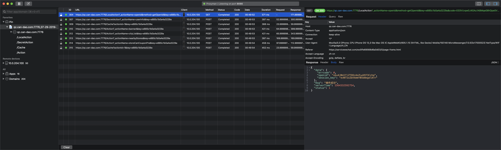

# Introduction

通过 Proxyman 抓包小程序首页发现第一次进入小程序的时候一共调用了 8 次接口


curl 'https://qc.can-dao.com:7776/SecretAction?_actionName=userInfo&key=e885c1b0a4a3229a' \
  -w '\n\nhttp: %{http_code}\ndns: %{time_namelookup}s\nredirect: %{time_redirect}s\ntime_connect: %{time_connect}s\ntime_appconnect: %{time_appconnect}s\ntime_pretransfer: %{time_pretransfer}s\ntime_starttransfer: %{time_starttransfer}s\nsize_download: %{size_download}bytes\nspeed_download: %{speed_download}B/s\n----------\ntime_total: %{time_total}s\n\n ' \
  -i -L -v \
  -H 'Cookie':'JSESSIONID=13983557-efb1-44c4-8423-873190e348bc'\
  -X POST -H 'Content-type':'application/json' \
  -d '{
  "actionName": "candao.user.getBaseInfo",
  "content": {}
}'

curl 'https://test.can-dao.com:7776/SecretAction?_actionName=userInfo&key=e885c1b0a4a3229a' \
  -w '\n\nhttp: %{http_code}\ndns: %{time_namelookup}s\nredirect: %{time_redirect}s\ntime_connect: %{time_connect}s\ntime_appconnect: %{time_appconnect}s\ntime_pretransfer: %{time_pretransfer}s\ntime_starttransfer: %{time_starttransfer}s\nsize_download: %{size_download}bytes\nspeed_download: %{speed_download}B/s\n----------\ntime_total: %{time_total}s\n\n ' \
  -i -L -v \
  -H 'Cookie':'JSESSIONID=13983557-efb1-44c4-8423-873190e348bc'\
  -X POST -H 'Content-type':'application/json' \
  -d '{
  "actionName": "candao.user.getBaseInfo",
  "content": {}
}'

curl 'https://test1.can-dao.com:6421/SecretAction?_actionName=userInfo&key=e885c1b0a4a3229a' \
  -w '\n\nhttp: %{http_code}\ndns: %{time_namelookup}s\nredirect: %{time_redirect}s\ntime_connect: %{time_connect}s\ntime_appconnect: %{time_appconnect}s\ntime_pretransfer: %{time_pretransfer}s\ntime_starttransfer: %{time_starttransfer}s\nsize_download: %{size_download}bytes\nspeed_download: %{speed_download}B/s\n----------\ntime_total: %{time_total}s\n\n ' \
  -i -L -v \
  -H 'Cookie':'JSESSIONID=13983557-efb1-44c4-8423-873190e348bc'\
  -X POST -H 'Content-type':'application/json' \
  -d '{
  "actionName": "candao.user.getBaseInfo",
  "content": {}
}'

curl 'http://test1.can-dao.com:664/SecretAction?_actionName=userInfo&key=e885c1b0a4a3229a' \
  -w '\n\nhttp: %{http_code}\ndns: %{time_namelookup}s\nredirect: %{time_redirect}s\ntime_connect: %{time_connect}s\ntime_appconnect: %{time_appconnect}s\ntime_pretransfer: %{time_pretransfer}s\ntime_starttransfer: %{time_starttransfer}s\nsize_download: %{size_download}bytes\nspeed_download: %{speed_download}B/s\n----------\ntime_total: %{time_total}s\n\n ' \
  -i -L -v \
  -H 'Cookie':'JSESSIONID=13983557-efb1-44c4-8423-873190e348bc'\
  -X POST -H 'Content-type':'application/json' \
  -d '{
  "actionName": "candao.user.getBaseInfo",
  "content": {}
}'

119.3.4.13:6421


## 分析请求
  * 每一个请求都有一个相同的请求参数 `key` ==> `e885c1b0a4a3229a`,暂时不知道是什么作用,16 位目测是是唯一标识符。
  * 每个请求还有一个 `_actionName` 应该是用于路由到哪一个子 action。
  * 按照有调用的 4 个 Action（不同于 `_actionName` 指向的子 action）
    - #### `/LocalAction?_actionName=openid&method=getOpenId&key=e885c1b0a4a3229a&code=033VUvpe0J4GAu1ABMqe08hDpe0VUvpS`
      目测应该是通过小程序进来所提供的临时登录凭证 code 去兑换相应用户的 openid（用户唯一标识） 以及 sessionKey（会话密钥
  ） 的。

    - #### /SecretAction
      * ##### `/SecretAction?_actionName=userInfo&key=e885c1b0a4a3229a`
      ```json
      {
        "actionName": "candao.user.getBaseInfo",
        "content": {}
      }
      ```

    - #### /Cache
      * ##### `/Cache?actionId=1&key=e885c1b0a4a3229a`
      ```json
      {
        "cityName": "广州市"
      }
      ```

    - #### /Action
      应该是用于调用 DC 接口
      * ##### `/Action?_actionName=banner&key=e885c1b0a4a3229a`
        ```json
        {
          "actionName": "candao.storeOwn.getWeChatAppSetting",
          "content": {}
        }
        ```
      * ##### `/Action?_actionName=cityList&key=e885c1b0a4a3229a`
        ```json
        {
          "actionName": "candao.storeStandard.getOpenCityList",
          "content": {}
        }
        ```
      * ##### `/Action?_actionName=nearbyStores&key=e885c1b0a4a3229a`
        ```json
        {
          "actionName": "candao.storeStandard.getNearStoreList",
          "content": {
            "businessType": [
              1,
              2,
              3,
              4
            ],
            "coordinate": [
              113.3620834350586,
              23.188568115234375
            ],
            "pageNow": 1,
            "pageSize": 999
          }
        }
        ```
      * ##### `/Action?_actionName=storeCanCouponPre&key=e885c1b0a4a3229a`
        ```json
        {
          "actionName": "candao.preferential.storeCanCouponPre",
          "content": {
            "cityId": 11478,
            "provinceId": 736
          }
        }
        ```

## 简单拓补请求流程
  根据捉包的数据可以很简单还原一下整一个首页的流程，当然具体内部做了什么操作现在暂时还是不清楚的,
  <br>
  拓补图如下：

