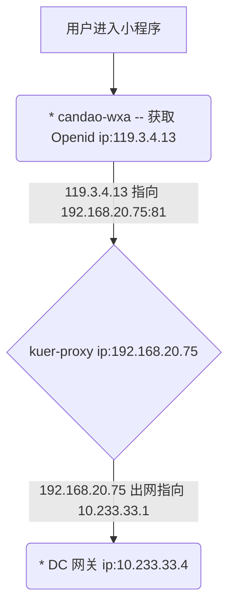

# 开始
我们先由 **/LocalAction** 这条请求做一个比较全面的分析

## 请求响应 RAW
**Request:**
```http
GET https://qc.can-dao.com:7776/LocalAction?_actionName=openid&method=getOpenId&key=e885c1b0a4a3229a&code=033VUvpe0J4GAu1ABMqe08hDpe0VUvpS HTTP/1.1
Host: qc.can-dao.com:7776
Content-Type: application/json
Connection: keep-alive
Accept: */*
User-Agent: Mozilla/5.0 (iPhone; CPU iPhone OS 13_0 like Mac OS X) AppleWebKit/605.1.15 (KHTML, like Gecko) Mobile/15E148 MicroMessenger/7.0.5(0x17000523) NetType/WIFI Language/zh_CN
Referer: https://servicewechat.com/wx5ffe69568d6a0d03/0/page-frame.html
Accept-Language: zh-cn
Accept-Encoding: gzip, deflate, br
```

**Response:**
```http
HTTP/1.1 200 OK
Server: Tengine/2.1.2
Date: Sun, 28 Jul 2019 16:46:31 GMT
Content-Type: application/json; charset=utf-8
Content-Length: 172
Connection: keep-alive
Access-Control-Allow-Origin: *
Set-Cookie: wxa_V1_openId=/8it5AClazvsvOTA2P0RNuyJKiAHxlKmKbAIpzChuPc=; path=/; expires=Wed
Set-Cookie:  31-Jul-2019 16:49:52 GMT; HttpOnly
Set-Cookie: wxa_V1_appId=NvnGOePmW6CROyZun4261ZklWi40OH5wXMa0wGmK1sI=; path=/; expires=Wed
Set-Cookie:  31-Jul-2019 16:49:52 GMT; HttpOnly
Set-Cookie: wxa_V1_sessionKey=pBa5P98i5A3xQZyLbQ9KTYEpbvX/mafdnbz0hQsCY5U=; path=/; expires=Wed
Set-Cookie:  31-Jul-2019 16:49:52 GMT; HttpOnly
Set-Cookie: wxa_V1_secretKey=DB7EgYkUnaT/bfVoUty855bsoNad9AKsAvpDiYG8utk=; path=/; expires=Wed
Set-Cookie:  31-Jul-2019 16:49:52 GMT; HttpOnly
Set-Cookie: wxa_V1_autoLogin=luyg1p30AqwC+kOJgby62Q==; path=/; expires=Thu
Set-Cookie:  01-Dec-1994 16:00:00 GMT; HttpOnly
Set-Cookie: JSESSIONID=08677145-59d1-42e2-a6b4-f67dd89a7a8f; path=/; secure; expires=Wed
Set-Cookie:  31-Jul-2019 16:49:52 GMT; HttpOnly

{"status":1,"msg":"操作成功","data":{"openid":"oku4J0dJfjZTOOcdoZLwVH73Czhg","session_key":"evNTsoZbVkmmY05b8egelA\u003d\u003d","errcode":0},"serverTime":1564332592754}
```

## Pinpoint Agent 收集到的数据
[点击查看 Pinpoint Agent 数据来源](http://qc.can-dao.com:6789/proxy_pass/#/transactionList/FRONT-candao-wxa@RESIN/20m/2019-07-29-01-00-00/HWY-119.3.4.13%5E1564135311682%5E390-1564332891760-128)
### 调用链路 Call Tree


### 服务调用拓补图 Server Map


通过调用链路以及拓补图可以发现 `candao-wxa` 调用了 1 次微信的 API 以及 2 次的 *192.168.20.75:81* 这个host,

*192.168.20.75:81* 这个 host 其实是指向 DC 端的网关（实际上是经过了 ELB 再到的 DC 网关,这个过程可以忽略损耗）
> **为什么无法直接拓补出DC网关以及后续的调用链路？**
>
> 因为 `candao-wxa` 作为 SDK 只是使用了偏传统的部署方式（直接在 CentOS 上安装一个 resin4 的 web 容器,然后把项目放在 WEB 容器中运行）而不是现在流行大热的容器编排（ docker,k8s，swarm）,
>
> 然而 Pinpoint 跟踪单个事务中的分布式请求，基于 Google Dapper
> > Google's Dapper
> >
> > 关于Google Dapper的更多信息, 请见 “[Dapper, a Large-Scale Distributed Systems Tracing Infrastructure.](http://research.google.com/pubs/pub36356.html)”
>
> Pinpoint基于google dapper的跟踪技术,但是已经修改为在调用的header中添加应用级别标签数据以便在远程调用中跟踪分布式事务。标签数据由多个key组成，定义为TraceId。
> Pinpoint中，核心数据结构由Span, Trace, 和 TraceId组成。
> * Span: RPC (远程过程调用/remote procedure call)跟踪的基本单元; 当一个RPC调用到达时指示工作已经处理完成并包含跟踪数据。为了确保代码级别的可见性，Span拥有带SpanEvent标签的子结构作为数据结构。每个Span包含一个TraceId。
> * Trace: 多个Span的集合; 由关联的RPC (Spans)组成. 在同一个trace中的span共享相同的TransactionId。Trace通过SpanId和ParentSpanId整理为继承树结构.
> * TraceId: 由 TransactionId, SpanId, 和 ParentSpanId 组成的key的集合. TransactionId 指明消息ID，而SpanId 和 ParentSpanId 表示RPC的父-子关系。
>  * TransactionId (TxId): 在分布式系统间单个事务发送/接收的消息的ID; 必须跨整个服务器集群做到全局唯一.
>  * SpanId: 当收到RPC消息时处理的工作的ID; 在RPC请求到达节点时生成。
>  * ParentSpanId (pSpanId): 发起RPC调用的父span的SpanId. 如果节点是事务的起点，这里将没有父span - 对于这种情况， 使用值-1来表示这个span是事务的根span。
>
> > Google Dapper 和 NAVER Pinpoint在术语上的不同
> >
> > Pinpoint中的术语"TransactionId"和google dapper中的术语"TraceId"有相同的含义。而Pinpoint中的术语"TraceId"引用到多个key的集合。
>
> ---
> *TraceId如何工作*
>
> 下图描述TraceId的行为，在4个节点之间执行了3次的RPC调用：
> 
> TransactionId (TxId) 体现了三次不同的RPC作为单个事务被相互关联。但是，TransactionId 本身不能精确描述PRC之间的关系。为了识别PRC之间的关系，需要SpanId 和 ParentSpanId (pSpanId). 假设一个节点是Tomcat，可以将SpanId想象为处理HTTP请求的线程，ParentSpanId代表发起这个RPC调用的SpanId.
>
> 使用TransactionId，Pinpoint可以发现关联的n个Span，并使用SpanId和ParentSpanId将这n个span排列为继承树结构。
SpanId 和 ParentSpanId 是 64位长度的整型。可能发生冲突，因为这个数字是任意生成的，但是考虑到值的范围可以从-9223372036854775808到9223372036854775807，不太可能发生冲突. 如果key之间出现冲突，Pinpoint和Google Dapper系统，会让开发人员知道发生了什么，而不是解决冲突。
>
> TransactionId 由 AgentIds, JVM (java虚拟机)启动时间, 和 SequenceNumbers/序列号组成.
> * AgentId: 当Jvm启动时用户创建的ID; 必须在pinpoinit安装的全部服务器集群中全局唯一. 最简单的让它保持唯一的方法是使用hostname($HOSTNAME)，因为hostname一般不会重复. 如果需要在服务器集群中运行多个JVM，请在hostname前面增加一个前缀来避免重复。
> * JVM 启动时间: 需要用来保证从0开始的SequenceNumber的唯一性. 当用户错误的创建了重复的AgentId时这个值可以用来预防ID冲突。
> * SequenceNumber: Pinpoint agent 生成的ID, 从0开始连续自增;为每个消息生成一个.
>
> Dapper 和 Zipkin, Twitter的一个分布式系统跟踪平台, 生成随机TraceIds (Pinpoint是TransactionIds) 并将冲突情况视为正常。然而, 在Pinpiont中我们想避免冲突的可能，因此实现了上面描述的系统。有两种选择：一是数据量小但是冲突的可能性高，二是数据量大但是冲突的可能性低。Pinpoint选择了第二种。
>
> ---
> 按照上面的信息结合实际情况，因为 DC 端使用的是 k8s 的容器编排策略,通过 kuer-proxy 转发请求到对应的 pod 上,转发的过程 Pinpoint 无法进行收集相应的数据,就像:
>

> **kuer-proxy** 因为 Pinpoint 无法收集监听,所有导致链路断掉,无法正确的关联起来
>
> 解决方法: 暂无。。。查阅过 Wiki 以及 Issues 均没有找到对应的解决方法,所有暂时先使用手动的方法去关联两条链路

## 手动关联 Call Tree 的链路关系
通过 **candao-wxa** 的 **Call Tree**


在 **HWY-api-gateway** 的 **Call Tree** 中按时间点和 action 找到对应的链路信息
### 第一次请求 WxaAction
[Call Tree](http://qc.can-dao.com:6789/proxy_pass/#/transactionList/HWY-api-gateway@RESIN/10m/2019-07-29-00-55-00/HWY-10.233.33.4%5E1564316313727%5E75130-1564332891646-8)


### 第二次请求 WxaAction
[Call Tree](http://qc.can-dao.com:6789/proxy_pass/#/transactionList/HWY-api-gateway@RESIN/10m/2019-07-29-00-55-00/HWY-10.233.33.4%5E1564316313727%5E75131-1564332891749-4)


## 分析
### 分析第一次请求 WxaAction
