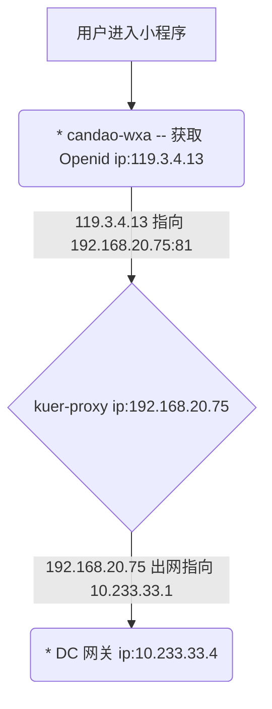

# 开始
我们先由 **/LocalAction** 这条请求做一个比较全面的分析

## 请求响应 RAW
**Request:**
```http
GET https://qc.can-dao.com:7776/LocalAction?_actionName=openid&method=getOpenId&key=e885c1b0a4a3229a&code=033VUvpe0J4GAu1ABMqe08hDpe0VUvpS HTTP/1.1
Host: qc.can-dao.com:7776
Content-Type: application/json
Connection: keep-alive
Accept: */*
User-Agent: Mozilla/5.0 (iPhone; CPU iPhone OS 13_0 like Mac OS X) AppleWebKit/605.1.15 (KHTML, like Gecko) Mobile/15E148 MicroMessenger/7.0.5(0x17000523) NetType/WIFI Language/zh_CN
Referer: https://servicewechat.com/wx5ffe69568d6a0d03/0/page-frame.html
Accept-Language: zh-cn
Accept-Encoding: gzip, deflate, br
```

**Response:**
```http
HTTP/1.1 200 OK
Server: Tengine/2.1.2
Date: Sun, 28 Jul 2019 16:46:31 GMT
Content-Type: application/json; charset=utf-8
Content-Length: 172
Connection: keep-alive
Access-Control-Allow-Origin: *
Set-Cookie: wxa_V1_openId=/8it5AClazvsvOTA2P0RNuyJKiAHxlKmKbAIpzChuPc=; path=/; expires=Wed
Set-Cookie:  31-Jul-2019 16:49:52 GMT; HttpOnly
Set-Cookie: wxa_V1_appId=NvnGOePmW6CROyZun4261ZklWi40OH5wXMa0wGmK1sI=; path=/; expires=Wed
Set-Cookie:  31-Jul-2019 16:49:52 GMT; HttpOnly
Set-Cookie: wxa_V1_sessionKey=pBa5P98i5A3xQZyLbQ9KTYEpbvX/mafdnbz0hQsCY5U=; path=/; expires=Wed
Set-Cookie:  31-Jul-2019 16:49:52 GMT; HttpOnly
Set-Cookie: wxa_V1_secretKey=DB7EgYkUnaT/bfVoUty855bsoNad9AKsAvpDiYG8utk=; path=/; expires=Wed
Set-Cookie:  31-Jul-2019 16:49:52 GMT; HttpOnly
Set-Cookie: wxa_V1_autoLogin=luyg1p30AqwC+kOJgby62Q==; path=/; expires=Thu
Set-Cookie:  01-Dec-1994 16:00:00 GMT; HttpOnly
Set-Cookie: JSESSIONID=08677145-59d1-42e2-a6b4-f67dd89a7a8f; path=/; secure; expires=Wed
Set-Cookie:  31-Jul-2019 16:49:52 GMT; HttpOnly

{"status":1,"msg":"操作成功","data":{"openid":"oku4J0dJfjZTOOcdoZLwVH73Czhg","session_key":"evNTsoZbVkmmY05b8egelA\u003d\u003d","errcode":0},"serverTime":1564332592754}
```

## Pinpoint Agent 收集到的数据
[点击查看 Pinpoint Agent 数据来源](http://qc.can-dao.com:6787/proxy_pass/#/transactionList/FRONT-candao-wxa@RESIN/20m/2019-07-29-01-00-00/HWY-119.3.4.13%5E1564135311682%5E390-1564332891760-128)
### 调用链路 Call Tree


### 服务调用拓补图 Server Map


通过调用链路以及拓补图可以发现 `candao-wxa` 调用了 1 次微信的 API 以及 2 次的 *192.168.20.75:81* 这个host,

*192.168.20.75:81* 这个 host 其实是指向 DC 端的网关（实际上是经过了 ELB 再到的 DC 网关,这个过程可以忽略损耗）
> **为什么无法直接拓补出DC网关以及后续的调用链路？**
>
> 因为 `candao-wxa` 作为 SDK 只是使用了偏传统的部署方式（直接在 CentOS 上安装一个 resin4 的 web 容器,然后把项目放在 WEB 容器中运行）而不是现在流行大热的容器编排（ docker,k8s，swarm）,
>
> 然而 Pinpoint 跟踪单个事务中的分布式请求，基于 Google Dapper
> > Google's Dapper
> >
> > 关于Google Dapper的更多信息, 请见 “[Dapper, a Large-Scale Distributed Systems Tracing Infrastructure.](http://research.google.com/pubs/pub36356.html)”
>
> Pinpoint基于google dapper的跟踪技术,但是已经修改为在调用的header中添加应用级别标签数据以便在远程调用中跟踪分布式事务。标签数据由多个key组成，定义为TraceId。
> Pinpoint中，核心数据结构由Span, Trace, 和 TraceId组成。
> * Span: RPC (远程过程调用/remote procedure call)跟踪的基本单元; 当一个RPC调用到达时指示工作已经处理完成并包含跟踪数据。为了确保代码级别的可见性，Span拥有带SpanEvent标签的子结构作为数据结构。每个Span包含一个TraceId。
> * Trace: 多个Span的集合; 由关联的RPC (Spans)组成. 在同一个trace中的span共享相同的TransactionId。Trace通过SpanId和ParentSpanId整理为继承树结构.
> * TraceId: 由 TransactionId, SpanId, 和 ParentSpanId 组成的key的集合. TransactionId 指明消息ID，而SpanId 和 ParentSpanId 表示RPC的父-子关系。
>  * TransactionId (TxId): 在分布式系统间单个事务发送/接收的消息的ID; 必须跨整个服务器集群做到全局唯一.
>  * SpanId: 当收到RPC消息时处理的工作的ID; 在RPC请求到达节点时生成。
>  * ParentSpanId (pSpanId): 发起RPC调用的父span的SpanId. 如果节点是事务的起点，这里将没有父span - 对于这种情况， 使用值-1来表示这个span是事务的根span。
>
> > Google Dapper 和 NAVER Pinpoint在术语上的不同
> >
> > Pinpoint中的术语"TransactionId"和google dapper中的术语"TraceId"有相同的含义。而Pinpoint中的术语"TraceId"引用到多个key的集合。
>
> ---
> *TraceId如何工作*
>
> 下图描述TraceId的行为，在4个节点之间执行了3次的RPC调用：
> 
> TransactionId (TxId) 体现了三次不同的RPC作为单个事务被相互关联。但是，TransactionId 本身不能精确描述PRC之间的关系。为了识别PRC之间的关系，需要SpanId 和 ParentSpanId (pSpanId). 假设一个节点是Tomcat，可以将SpanId想象为处理HTTP请求的线程，ParentSpanId代表发起这个RPC调用的SpanId.
>
> 使用TransactionId，Pinpoint可以发现关联的n个Span，并使用SpanId和ParentSpanId将这n个span排列为继承树结构。
SpanId 和 ParentSpanId 是 64位长度的整型。可能发生冲突，因为这个数字是任意生成的，但是考虑到值的范围可以从-9223372036854775808到9223372036854775807，不太可能发生冲突. 如果key之间出现冲突，Pinpoint和Google Dapper系统，会让开发人员知道发生了什么，而不是解决冲突。
>
> TransactionId 由 AgentIds, JVM (java虚拟机)启动时间, 和 SequenceNumbers/序列号组成.
> * AgentId: 当Jvm启动时用户创建的ID; 必须在pinpoinit安装的全部服务器集群中全局唯一. 最简单的让它保持唯一的方法是使用hostname($HOSTNAME)，因为hostname一般不会重复. 如果需要在服务器集群中运行多个JVM，请在hostname前面增加一个前缀来避免重复。
> * JVM 启动时间: 需要用来保证从0开始的SequenceNumber的唯一性. 当用户错误的创建了重复的AgentId时这个值可以用来预防ID冲突。
> * SequenceNumber: Pinpoint agent 生成的ID, 从0开始连续自增;为每个消息生成一个.
>
> Dapper 和 Zipkin, Twitter的一个分布式系统跟踪平台, 生成随机TraceIds (Pinpoint是TransactionIds) 并将冲突情况视为正常。然而, 在Pinpiont中我们想避免冲突的可能，因此实现了上面描述的系统。有两种选择：一是数据量小但是冲突的可能性高，二是数据量大但是冲突的可能性低。Pinpoint选择了第二种。
>
> ---
> 按照上面的信息结合实际情况，因为 DC 端使用的是 k8s 的容器编排策略,通过 kuer-proxy 转发请求到对应的 pod 上,转发的过程 Pinpoint 无法进行收集相应的数据,就像:
>

> **kuer-proxy** 因为 Pinpoint 无法收集监听,所有导致链路断掉,无法正确的关联起来
>
> 解决方法: 暂无。。。查阅过 Wiki 以及 Issues 均没有找到对应的解决方法,所有暂时先使用手动的方法去关联两条链路

## 手动关联 Call Tree 的链路关系
通过 **candao-wxa** 的 **Call Tree**


在 **HWY-api-gateway** 的 **Call Tree** 中按时间点和 action 找到对应的链路信息
### 第一次请求 WxaAction
[Call Tree](http://qc.can-dao.com:6787/proxy_pass/#/transactionList/HWY-api-gateway@RESIN/10m/2019-07-29-00-55-00/HWY-10.233.33.4%5E1564316313727%5E75130-1564332891646-8)


### 第二次请求 WxaAction
[Call Tree](http://qc.can-dao.com:6787/proxy_pass/#/transactionList/HWY-api-gateway@RESIN/10m/2019-07-29-00-55-00/HWY-10.233.33.4%5E1564316313727%5E75131-1564332891749-4)


## 分析
### 分析第一次请求 WxaAction
拉取出对应的 **Call Tree** 以及 **Server Map**,如图所示:


根据数据我们可以得知请求进来调用一次 candao-user 系统以及一次 candao-pay 系统,<br>
**Call Tree** 中我标了 4 个序号,我们来一一分析:
- ① 根据 Pinpoint 的结果得知请求调用了 `/WxaAction` 的 *doPost* 方法后第一次调用外部服务为 **candao-user** 的 Dubbo Provider,
而且调用的是 `IUserService:getUserBySecretKey`,总耗时用了不足 0ms (Exec 指标)。<br>
结合代码分析是针对 C 端获取用户的 SecretKey,所以我们跳过。
```java
// com.candao.gateway.service.ApiManager#setCommonObj
    private ReqData setCommonObj(ReqData reqData) {
    		if (reqData instanceof ReqCClientData) {
    			String secretKey = ((ReqCClientData) reqData).secretKey;
    			User user = ((IUserService) ServiceLoader.getService("userService")).getUserBySecretKey(secretKey);
    			reqData.setObj(user);
    		} else if (reqData instanceof ReqBClientData) {
    			...
    		}
    }
```

- ② - ③ 进入请求后发起的第二次调用的目标是 **candao-pay** 的 `IPayCApi:getAuth`,总耗时用了 6ms 左右。主要是用于获取授权信息的接口。
```java
// com.candao.pay.PayCApi#getAuth
    @Override
    public String getAuth(ReqData reqData) {
        ReqCClientData reqCClientData = (ReqCClientData) reqData;
        String key = reqCClientData.key;
        String platformKey = reqCClientData.platformKey;
        int clientType = reqCClientData.clientType;
        WxAuth wxAuth = wxAuthService.getAuth(platformKey, key, clientType);
        RspWxAuth rspWxAuth = null;
        if (wxAuth != null && wxAuth.status == DataStatus.ENABLE.getValue()) {
            Logger.info("返回授权配置name = " + wxAuth.name + ", platformKey = " + platformKey + ", key = " + key);
            rspWxAuth = RspWxAuth.create(wxAuth, clientType);
        }
        if (rspWxAuth == null) {
            // 获取餐道微信配置
            Logger.info("返回餐道授权platformKey = " + platformKey + ", key = " + key);
            rspWxAuth = RspWxAuth.defaultAuth(clientType);
        }
        return RspData.retSuccess(rspWxAuth);
    }
```

- ④ 这里和 redis 进行了 5 次的通讯,前面三次不清楚怎么回事(一般情况下系统启动时理论上 jedis 连接池都会初始化而且代码的确是实现了,而且生成这批数据的时候并没有重启系统,所以不大清楚为什么会重新开了一个新的连接而不是使用连接池的),然后分别调用了 Redis 两次 get 命令,也符合代码中两次获取缓存的 `getWxAuthByCacheKey` 这个方法:
```java
// com.candao.pay.service.WxAuthService#getAuth
    /**
     * 首先根据商家key查询对应的授权配置,如商家key没有再根据platformKey查询
     * @param platformKey 平台key
     * @param key 商家key
     * @return
     */
    @Override
    public WxAuth getAuth(String platformKey, String key, int clientType) {
      // 根据平台key+商家key查询,查询到直接返回
      int type =WxAuth.getType(clientType);
      if (!StringUtil.isNullOrEmpty(key)) {
        String cacheTypeKey = type+"_"+key;
        String cacheKey = wxAuthToKeyCacheKeyType(cacheTypeKey);
        Integer id = getWxAuthByCacheKey(cacheKey,type, platformKey, key, null);
        if (id != null && id > 0) {
          return this.get(id);
        }
      }
      // 根据平台key查询
      String platformCacheKey = wxAuthToPlatformKeyCacheKey(platformKey);
      Integer id = getWxAuthByCacheKey(platformCacheKey,type, platformKey, null, null);
      if (id != null && id > 0) {
        return this.get(id);
      }
      return null;
    }
```
所以,**按照代码中两种维度去获取缓存这个操作已经是不需要优化的了**,假如需要优化的话也只能减少第一个缓存没有命中的情况下不用再去发起第二次查询 redis,可是由于 `getWxAuthByCacheKey` 下底层使用的是 `public static <T> T getDataFromRedisOrDataGeter(String cacheKey, Class<T> clazz, DataGeter<T> dataGeter)` 这个方法查询数据和缓存操作耦合在了一起,改动过于繁杂,所以也无法使用批量命令。

### 分析第二次请求 WxaAction
拉取出对应的 **Call Tree** 以及 **Server Map**,如图所示:


根据数据我们可以得知请求进来调用一次 candao-user 系统,<br>
**Call Tree** 中我标了 3 个序号,我们来一一分析:
- ① 按照之前的分析,这里是是针对 C 端获取用户的 SecretKey,所以我们跳过。

- ② - ③ 根据调用链路得知调用的是 `IUserCApi:getSecretKeyByOpenId` 这个方法,按照下面的链路结果不需要查阅代码也可以知道是通过缓存去获取 **SecretKey**,所以这个也不需要优化。

## 总结

- ### ① 第一次调用 DC 的 `WxaAction`
  第一次主要是用于获取授权信息的接口,耗时也比较少(案例中耗时为 15 ms,`Gap` 指标为业务逻辑到调用的间隔,使用了 3ms,`Exec`指标为实际调用花费了 12ms)。

- ### ② 调用微信 API
  需要把 code 换成 openid 的必须渠道,所以没法子,耗时在 97ms 左右,耗时最久的一个操作。
  

- ### ③ 第二次调用 DC 的 `WxaAction`
  用于获取 **SecretKey** 的接口,耗时也比较少,案例中 6ms。

所以,最后的结果是暂时没有可以优化的方案,毕竟没有得优化则代表做得很好啦。
