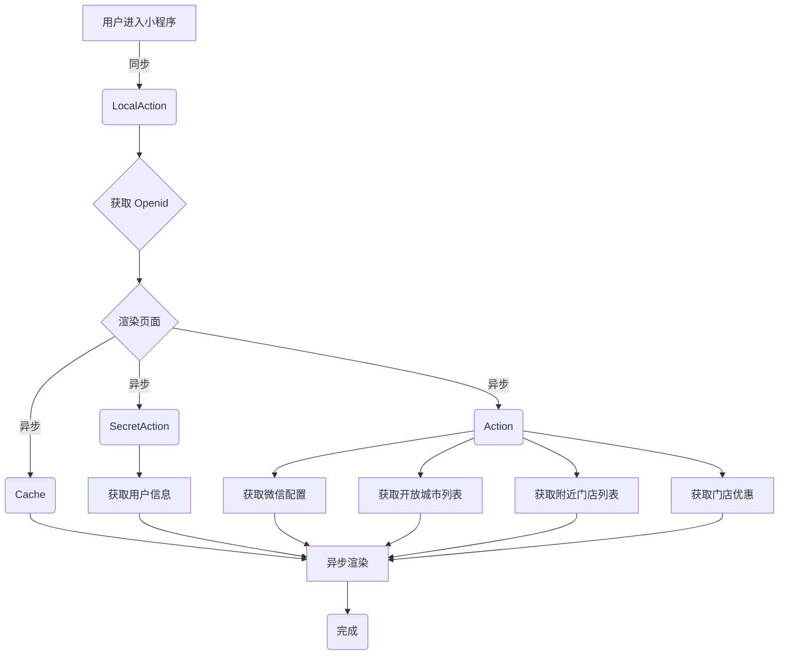

# 开始

通过 Proxyman 抓包小程序首页发现第一次进入小程序的时候一共调用了 8 次接口


## 分析请求
  * 每一个请求都有一个相同的请求参数 `key` ==> `e885c1b0a4a3229a`,暂时不知道是什么作用,16 位目测是是唯一标识符。
  * 每个请求还有一个 `_actionName` 应该是用于路由到哪一个子 action。
  * 按照有调用的 4 个 Action（不同于 `_actionName` 指向的子 action）
    - #### `/LocalAction`
      * ##### `/LocalAction?_actionName=openid&method=getOpenId&key=e885c1b0a4a3229a&code=033VUvpe0J4GAu1ABMqe08hDpe0VUvpS`
      目测应该是通过小程序进来所提供的临时登录凭证 code 去兑换相应用户的 openid（用户唯一标识） 以及 sessionKey（会话密钥） 的。

    - #### /SecretAction
      * ##### `/SecretAction?_actionName=userInfo&key=e885c1b0a4a3229a`
      ```json
      {
        "actionName": "candao.user.getBaseInfo",
        "content": {}
      }
      ```

    - #### /Cache
      * ##### `/Cache?actionId=1&key=e885c1b0a4a3229a`
      ```json
      {
        "cityName": "广州市"
      }
      ```

    - #### /Action
      应该是用于调用 DC 接口
      * ##### `/Action?_actionName=banner&key=e885c1b0a4a3229a`
        ```json
        {
          "actionName": "candao.storeOwn.getWeChatAppSetting",
          "content": {}
        }
        ```
      * ##### `/Action?_actionName=cityList&key=e885c1b0a4a3229a`
        ```json
        {
          "actionName": "candao.storeStandard.getOpenCityList",
          "content": {}
        }
        ```
      * ##### `/Action?_actionName=nearbyStores&key=e885c1b0a4a3229a`
        ```json
        {
          "actionName": "candao.storeStandard.getNearStoreList",
          "content": {
            "businessType": [
              1,
              2,
              3,
              4
            ],
            "coordinate": [
              113.3620834350586,
              23.188568115234375
            ],
            "pageNow": 1,
            "pageSize": 999
          }
        }
        ```
      * ##### `/Action?_actionName=storeCanCouponPre&key=e885c1b0a4a3229a`
        ```json
        {
          "actionName": "candao.preferential.storeCanCouponPre",
          "content": {
            "cityId": 11478,
            "provinceId": 736
          }
        }
        ```

## 简单拓补请求流程
  根据捉包的数据可以很简单还原一下整一个首页的流程，当然具体内部做了什么操作现在暂时还是不清楚的,
  <br>
  拓补图如下：



对于业务逻辑没有改变的情况下,我们要对这个流程的请求响应进行优化的话,<br>
首先根据 Proxyman 捉包的结果 :
发现每一个请求的耗时都在 400ms 以上,这个时候我们假设真的业务需要跑这么久加上请求来回的耗时

然后我们根据请求时间大致获取一个时间范围`00:49:00 - 00:50:00`然后通过 Pinpoint 拉取对应的请求记录
> 因为获取数据的时候服务器时间不一致可能导致查询有些问题,所以这里我把时间根据实际情况改成了`00:52:00 - 00:55:00` 作为查询,可是数据获取的时间依然是正确的时间,这个小瑕疵待看源码再确定原因


通过 Res.(ms) 这项数据,这 8 次调用其实耗时都在几十毫秒左右,除了 LocalAction 达到了 128ms。<br>
既然如此,我们列出来分析一下:

| # | Proxyman ID | Pinpoint No |  Action                            |  客户端请求耗时 | 实际业务耗时 | 相差耗时 |
| - | -           | -           |  ----                              | ----          | ----       | ----   |
| 1 | 304         | 8           | /LocalAction?_actionName=openid... | 571 ms        | 128 ms     | 443 ms |
| 2 | 307         | 7           | /SecretAction?_actionName=userI... | 397 ms        | 18 ms      | 379 ms |
| 3 | 309         | 6           | /Cache?actionId=1&key=e885c1b0a... | 388 ms        | 8 ms       | 380 ms |
| 4 | 310         | 5           | /Action?_actionName=banner&key=... | 421 ms        | 38 ms      | 383 ms |
| 5 | 312         | 4           | /Action?_actionName=cityList&ke... | 421 ms        | 35 ms      | 386 ms |
| 6 | 313         | 3           | /Action?_actionName=nearbyStore... | 397 ms        | 65 ms      | 332 ms |
| 7 | 314         | 2           | /Action?_actionName=storeCanCou... | 458 ms        | 13 ms      | 445 ms |
| 8 | 315         | 1           | /Cache?actionId=1&key=e885c1b0a... | 452 ms        | 26 ms      | 426 ms |

初步发现请求耗时和实际业务耗时相差有点大,而且稳定相差值都在 400ms 上下,这个应该和网络传输有着莫大的关系,<br>
所有接下来的优化分析可以分成两个思路:
# 网络传输层面优化
主要针对非代码级别以及网络传输方面的优化分析
- **[针对 SSL/TLS 握手协议](analysis/transportlayer/TransportLayerSecurity.md)**
  * **\*未完成**

# 代码逻辑层面优化
主要针对代码逻辑级别的优化分析
- **[/LocalAction](/analysis/businesslayer/LocalAction.md)**
  * 作为一个完整的案例做详细分析解释

- **[/SecretAction](/analysis/businesslayer/SecretAction.md)**
  * **\*未完成**

- **[/Cache](/analysis/businesslayer/Cache.md)**
  * **\*未完成**

- **/Action**
  * **[banner](analysis/businesslayer/Action/banner.md)**
    * **\*未完成**
  * **[cityList](analysis/businesslayer/Action/cityList.md)**
    * **\*未完成**
  * **[nearbyStores](analysis/businesslayer/Action/nearbyStores.md)**
    * **\*未完成**
  * **[storeCanCouponPre](analysis/businesslayer/Action/storeCanCouponPre.md)**
    * **\*未完成**
