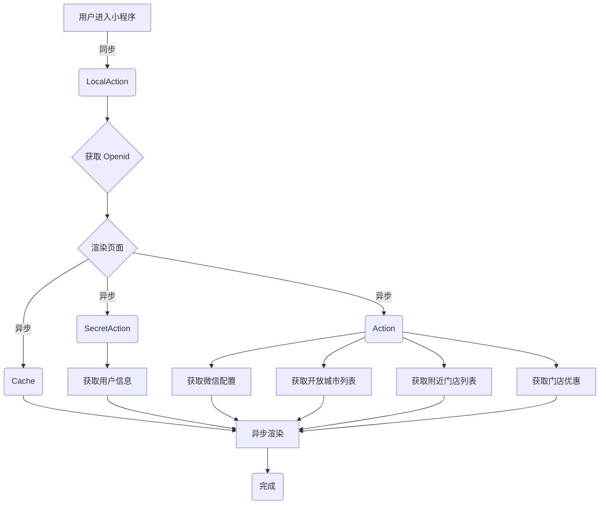

根据捉包拓补的流程图

对于业务逻辑没有改变的情况下,我们要对这个流程的请求响应进行优化的话, 
首先根据 Proxyman 捉包的结果 :
发现每一个请求的耗时都在 400ms 以上,这个时候我们假设真的业务需要跑这么久加上请求来回的耗时

然后我们根据请求时间大致获取一个时间范围`00:49:00 - 00:50:00`然后通过 Pinpoint 拉取对应的请求记录
> 因为获取数据的时候服务器时间不一致可能导致查询有些问题,所以这里我把时间根据实际情况改成了`00:52:00 - 00:55:00` 作为查询,可是数据获取的时间依然是正确的时间,这个小瑕疵待看源码再确定原因

通过 Res.(ms) 这项数据,这 8 次调用其实耗时都在几十毫秒左右,除了 LocalAction 达到了 128ms。 
既然如此,我们列出来分析一下:

| # | Proxyman ID | Pinpoint No |  Action                            |  客户端请求耗时 | 实际业务耗时 | 相差耗时 |
| - | -           | -           |  ----                              | ----          | ----       | ----   |
| 1 | 304         | 8           | /LocalAction?_actionName=openid... | 571 ms        | 128 ms     | 443 ms |
| 2 | 307         | 7           | /SecretAction?_actionName=userI... | 397 ms        | 18 ms      | 379 ms |
| 3 | 309         | 6           | /Cache?actionId=1&key=e885c1b0a... | 388 ms        | 8 ms       | 380 ms |
| 4 | 310         | 5           | /Action?_actionName=banner&key=... | 421 ms        | 38 ms      | 383 ms |
| 5 | 312         | 4           | /Action?_actionName=cityList&ke... | 421 ms        | 35 ms      | 386 ms |
| 6 | 313         | 3           | /Action?_actionName=nearbyStore... | 397 ms        | 65 ms      | 332 ms |
| 7 | 314         | 2           | /Action?_actionName=storeCanCou... | 458 ms        | 13 ms      | 445 ms |
| 8 | 315         | 1           | /Cache?actionId=1&key=e885c1b0a... | 452 ms        | 26 ms      | 426 ms |

初步发现请求耗时和实际业务耗时相差有点大,而且稳定相差值都在 400ms 上下,这个应该和网络传输有着莫大的关系, 
所有接下来的优化分析可以分成两个思路:
# 网络传输层面优化
主要针对非代码级别以及网络传输方面的优化分析
- [网络传输层面优化](/analysis/transportlayer.md)

# 代码逻辑层面优化
主要针对代码逻辑级别的优化分析
- [代码逻辑层面优化](/analysis/businesslayer.md)
